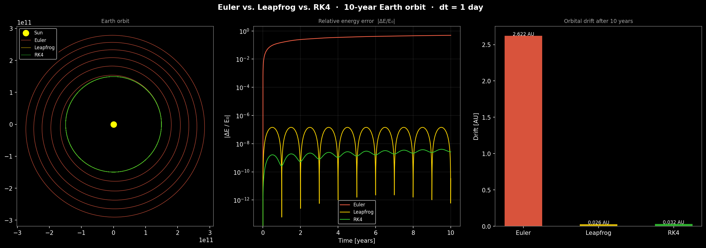

# N-Body Gravitational Simulation

> Numerical physics in Python — from Newtonian gravity to animated N-body systems, with a rigorous comparison of Euler, RK4, and Leapfrog integrators.

This project simulates gravitational interactions between N masses in 2D space. Starting from the classic 2-body problem (Earth + Sun), it scales to chaotic N-body systems and benchmarks three numerical integration strategies on a question that matters in real astrophysics: *which integrator keeps energy conserved over long timescales?*

**Stack:** Python 3 · NumPy · Matplotlib — no additional dependencies.

---

## Results

### Integrator accuracy (Earth orbit, dt = 1 day, 3 years)

| Integrator | Order | Orbital drift | Max energy error |
|---|---|---|---|
| Euler     | O(dt)   | `2.18 × 10¹¹ m` | `30 %` |
| Leapfrog  | O(dt²)  | `1.08 × 10⁹ m`  | `< 0.01 %` |
| RK4       | O(dt⁴)  | `1.91 × 10⁹ m`  | `0.0000002 %` |

**Why Leapfrog matters:** RK4 wins on per-step precision, but it is *not symplectic* — over centuries, its energy error accumulates. Leapfrog conserves a shadow Hamiltonian exactly, so energy error stays bounded regardless of simulation length. This is why symplectic integrators dominate production astrophysics codes.



---

## Project structure

```
n-body-simulation/
├── README.md
├── requirements.txt
├── src/
│   ├── nbody.py             → shared physics: forces, energy, Euler / Leapfrog / RK4
│   ├── orbit.py             → Euler 2-body demo, orbital drift visualization
│   ├── orbit_rk4.py         → Euler vs. RK4 comparison, energy error plot
│   ├── orbit_compare.py     → Euler vs. Leapfrog vs. RK4 — long-run stability
│   ├── orbit_3body.py       → Sun + Earth + Jupiter, 5-year simulation
│   ├── orbit_chaos.py       → chaos: 1,000 km initial offset → AU-scale divergence
│   ├── orbit_animate.py     → real-time solar system animation (RK4)
│   └── orbit_animate_n.py   → N random bodies animated with trails
├── tests/
│   └── test_physics.py      → pytest suite: force laws, energy conservation, accuracy
├── steps/                   → learning scaffolding — one concept per file
│   ├── v_earth.py
│   ├── calculate_force.py
│   ├── euler_step.py
│   └── run_simulation.py
└── plots/                   → saved outputs
```

---

## Physics

### Newtonian gravity

```
F = G · m₁ · m₂ / |r|²   (magnitude)
a = G · m_j / |r_ij|³ · r_ij   (acceleration vector on body i from body j)
```

`G = 6.674 × 10⁻¹¹ m³ kg⁻¹ s⁻²`

### State-space formulation

```
dx/dt = v
dv/dt = a = Σ_{j≠i}  G · m_j / |r_ij|³ · r_ij
```

This is the same state-space representation used in control theory — `[x, v]` is the system state, gravity is the input forcing term.

### Energy as a quality metric

```
E_kin = ½ m |v|²
E_pot = -G m_i m_j / |r_ij|   (per pair)
E_total = E_kin + E_pot = const.
```

A good integrator keeps `|ΔE / E₀|` small. Euler does not.

---

## Numerical integrators

### Euler — O(dt), not symplectic

```
x(t+dt) = x(t) + v(t) · dt
v(t+dt) = v(t) + a(t) · dt
```

Simple and cheap, but energy grows monotonically — orbits spiral outward.

### Leapfrog (Velocity Verlet / KDK) — O(dt²), **symplectic**

```
v(t + dt/2) = v(t) + a(t) · dt/2             # half-kick
x(t + dt)   = x(t) + v(t + dt/2) · dt        # drift
v(t + dt)   = v(t + dt/2) + a(t+dt) · dt/2   # half-kick
```

Two force evaluations per step. Symplectic structure means energy error is *bounded* — it oscillates but never drifts, regardless of how long you run the simulation.

### RK4 — O(dt⁴), not symplectic

```
k1 = f(t,      y)
k2 = f(t+dt/2, y + k1·dt/2)
k3 = f(t+dt/2, y + k2·dt/2)
k4 = f(t+dt,   y + k3·dt)

y(t+dt) = y(t) + (k1 + 2k2 + 2k3 + k4) · dt/6
```

Four force evaluations per step. Most accurate per step, but non-symplectic energy error eventually accumulates in very long runs.

---

## Setup

```bash
pip install numpy matplotlib pytest
python3 -m pytest tests/ -v          # 8 tests: force laws + energy conservation
python3 src/orbit_compare.py         # Euler vs. Leapfrog vs. RK4 (main result)
python3 src/orbit_animate_n.py       # N-body live animation
python3 src/orbit_chaos.py           # chaos sensitivity experiment
```

---

## Learning phases

| Phase | Topic | Key insight |
|---|---|---|
| 1 | Euler + 2-body | First ellipse, drift made visible by measuring end-to-start distance |
| 2 | 3-body + chaos | 1,000 km offset → ~1 AU divergence after 10 years |
| 3 | RK4 + energy measurement | 140 million× better energy conservation at same dt |
| 4 | Animation + N-body | Real-time RK4 simulation with trails, mass-scaled markers |
| 5 | Leapfrog + symplecticity | Bounded energy error independent of simulation length |

---

## Connections

| Field | Connection |
|---|---|
| Control / mechatronics | State space `[x, v]` is identical to system state in control theory |
| Signal processing | FFT on trajectory data extracts orbital periods |
| Sensor fusion | Kalman filter for noisy position estimates uses the same predict–update structure |
| Structural acoustics | Energy conservation as a validation metric — same principle as in FEM convergence checks |
